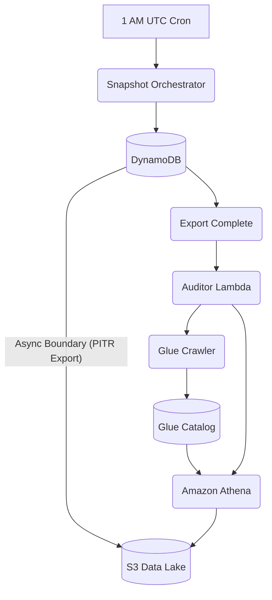

# Serverless Privacy Signal Analyzer
### Batch-Snapshot Compliance Auditing with AWS Glue & Athena

A cost-effective engine for auditing privacy signals across AWS data lakes using a **Daily Snapshot** architecture.

## What Problem This Solves
Ensures 100% compliance visibility for PII (Personally Identifiable Information) without the cost and complexity of real-time streaming or the performance impact of scanning production databases.

## One Real Constraint
**Scale:** Designed for volumes up to ~100K records/day. Beyond this, the Glue Crawler discovery phase may exceed Lambda timeouts and require migration to Fargate.

## TL;DR
- **Zero-Stream Overhead:** Uses native DynamoDB PITR exports to S3.
- **Async Orchestration:** EventBridge triggers the audit only after export completion.
- **Deterministic Audits:** Queries execute against stable point-in-time snapshots.
- **Structural Isolation:** Business logic is decoupled from AWS SDK via Python Protocols.
- **Cost Efficient:** Pay-per-query (Athena) and pay-per-request (DynamoDB).

---

## Architecture



### Ingestion & Async Boundary
- **Entry Point:** Data is ingested into a DynamoDB table (`PrivacyLogsTable`).
- **Async Boundary:** The system transitions from transactional to analytical via **DynamoDB Export to S3**. This is triggered daily at 1 AM UTC.

### Durability & Idempotency
- **Durability:** Data is stored in DynamoDB (Standard) and exported to S3 (Standard) with versioning/lifecycle policies.
- **Idempotency:** The `SnapshotStart` function is idempotent; multiple calls for the same point-in-time will either trigger a new export or return the existing one. Athena query results are stored in a unique S3 path per audit.

### Downstream Protection
- **Rate Limits:** Offloads heavy scanning to Amazon Athena, protecting DynamoDB RCU.
- **Backpressure:** Glue Crawler and Athena handle large-scale metadata discovery and query execution natively, preventing Lambda memory exhaustion.

---

## Environment Hub

| Environment | Purpose | Documentation |
| :--- | :--- | :--- |
| **Local** | Logic verification & Stress testing | [local.md](docs/local.md) |
| **Production** | Real-scale compliance auditing | [production.md](docs/production.md) |
| **Migration** | Component transition (Lambda -> Fargate) | [migration.md](docs/migration.md) |

---

## Key Design Decisions
- **Why Chosen Tech:** AWS Lambda for orchestration (low cost), S3/Athena for storage/query (infinite scale), and Glue for schema discovery.
- **Ordering & Idempotency:** Audit order is determined by the export timestamp. Idempotency is maintained by checking export status before re-triggering.
- **Concurrency & Retries:** Uses `utils.py` for exponential backoff when polling AWS services.

## Scale & Limits
- **Expected Traffic:** ~100K records/day snapshot.
- **First Bottleneck:** AWS Glue Crawler execution time. If discovery exceeds 15 minutes, it must move to ECS Fargate.
- **Non-Goals:** Real-time PII detection, automated data scrubbing (audit only).

## Failure Modes
- **Common Failure:** DynamoDB Export fails or times out.
- **System Response:** EventBridge event will not fire; Auditor Lambda remains idle.
- **Recovery Strategy:** Manual trigger of `SnapshotStart` for the missed window.

---

## Quickstart (Local Only)

### Prereqs
- Python 3.9+
- `pip install -r requirements.txt`

### One command to run
```bash
python3 mock_local_test.py
```

### One command to test
```bash
python3 mock_stress_test.py
```

---

**Footer:** This project maintains strict separation between Local (Mocked SDK) and Production (Boto3/AWS) environments via Python Protocols.
