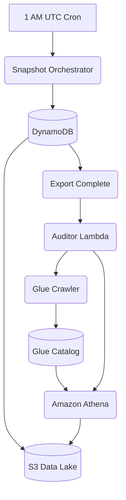

# Serverless Privacy Signal Analyzer (v1.0)
## Batch-Snapshot Compliance Auditing with AWS Glue & Athena

The Serverless Privacy Signal Analyzer is a cost-effective engine for auditing privacy signals across AWS data lakes. It uses a **Daily Snapshot** architecture, exporting DynamoDB state to S3 and using AWS Glue to maintain queryable metadata for Athena-based compliance checks.





## Codebase Architecture
The project follows **SOLID principles** and **Domain-Driven Design (DDD)**, utilizing **Python Protocols** for structural typing and strict interface segregation.

### 1. Privacy Auditor (`auditor/`)
Main entry point is `privacy_auditor.py`: A 3-tier dependency injection wrapper.
- **[`discovery/`](auditor/discovery/)**: Encapsulates all Glue metadata discovery logic.
- **[`analytics/`](auditor/analytics/)**: Encapsulates all Athena query execution logic.
- **`orchestrator.py`**: Coordinates the cross-domain workflow between discovery and analytics.

### 2. Snapshot Orchestrator (`snapshot/`)
Main entry point is `snapshot_entrypoint.py`: Manages the lifecycle of DynamoDB state replication.
- **[`interfaces.py`](snapshot/interfaces.py)**: Snapshot domain protocols.
- **[`dao.py`](snapshot/dao.py)**: Boto3-based export and invocation handlers.
- **[`service.py`](snapshot/service.py)**: High-level snapshot lifecycle management.

### 3. Support & Verification
- **`utils.py`**: Shared logging and polling utilities used across all domains.
- **`mock_local_test.py`**: Full Zero-AWS logic verification suite (Mocked AWS SDK).
- **`mock_stress_test.py`**: High-concurrency logic stress simulation.

---

## The Daily Snapshot Workflow
To ensure 100% compliance visibility with maximum efficiency, the system utilizes a **Periodic Batch Snapshot** (1 AM UTC) instead of complex real-time streaming.

### Why Batch Snapshot?
- **Lightweight Orchestration**: AWS Lambda is used only for orchestration (export initiation, event handling, query triggering), not for data processing. This ensures the system remains fast regardless of volume.
- **Zero-Stream Overhead**: Eliminates the cost of "idle" Lambda executions and protects production Read Capacity Units (RCU) by leveraging native S3 exports.
- **Predictable Performance**: Athena queries execute against native snapshot exports with snapshot-level pruning and predicate pushdown.
- **Fully Asynchronous**: Export completion is surfaced via EventBridge after status transitions to `COMPLETED`, ensuring orchestration without manual polling.
- **Data Consistency**: Audits are performed against a definitive point-in-time snapshot, providing a stable source of truth for compliance reporting.

> [!NOTE]
> **Scale Assumption**: This system is designed for low to moderate data volumes (up to ~100K records per day), where full-table snapshots remain fast, cost-efficient, and operationally simple.

### Data Sharding & Parallelism
The system handles growing datasets by leveraging native AWS sharding:
- **Automatic Export Sharding**: DynamoDB PITR exports automatically shard your data into multiple compressed S3 objects based on partition density.
- **Parallel Analysis**: Amazon Athena executes queries in parallel across these shards, providing high-throughput compliance scanning without requiring manual data partitioning logic.

At current scale (≤100K records/day), sharding is largely transparent and requires no manual tuning.

#### Expected S3 Data Lifecycle
At the end of each day (1 AM UTC), S3 contains a new sharded snapshot:
```text
s3://your-data-lake-bucket/exports/
  └── AWSDynamoDB/
      └── 01673050000000-abcd1234/
          ├── manifest-summary.json
          └── data/
              ├── shard-00001.json.gz
              ├── shard-00002.json.gz
              └── ... (Auto-sharded based on table size)
```

#### Source Data Pattern (DynamoDB JSON)
The snapshot contains raw DynamoDB JSON records exported by AWS:
```json
{
  "Item": {
    "user_id": {"S": "u-987"},
    "email": {"S": "alice@example.com"},
    "privacy_status": {"S": "opt_out"},
    "metadata": {"S": "{\"backup_contact\": \"555-0199\"}"},
    "timestamp": {"S": "2026-01-06T11:00:00Z"}
  }
}
```

#### Flattened Schema (Athena View)
AWS Glue crawls these exports and flattens them into a standard SQL schema for Athena:
| user_id | email | privacy_status | metadata | timestamp |
| :--- | :--- | :--- | :--- | :--- |
| u-987 | alice@example.com | opt_out | {"backup_contact": "555-0199"} | 2026-01-06T11:00:00Z |

*Note: The `OPT_OUT_VIOLATION` is triggered because `email` persists despite the `opt_out` status, and `DATA_RENAME_DETECTION` triggers on PII patterns hidden inside the `metadata` string.*

Note: audits evaluate the full snapshot state (which may exceed daily ingest volume), not only the daily delta.
The Auditor generates a definitive compliance report stored in S3:
```json
{
  "audit_timestamp": "2026-01-06T01:05:00Z",
  "total_records_scanned": 1500000,
  "privacy_signals_detected": [
    {"user_id": "u-987", "signal": "OPT_OUT_VIOLATION", "severity": "CRITICAL"},
    {"user_id": "u-456", "signal": "DATA_RENAME_DETECTION", "severity": "MEDIUM"}
  ],
  "compliance_status": "NON_COMPLIANT"
}
```

#### Privacy Signal Definitions
Signals are derived heuristics computed from snapshot state and are intentionally conservative.

- **`OPT_OUT_VIOLATION`**: Detected when a record has a `privacy_status: 'opt_out'` flag but the row still contains unscrubbed PII. This indicates that data marked for deletion still contains active PII at audit time, suggesting a potential cleanup failure.
- **`DATA_RENAME_DETECTION`**: Detected when Athena finds email or phone patterns inside generic columns like `json_payload` or `metadata`. This flags PII that has been "hidden" in non-PII fields.

> [!IMPORTANT]
> **Production Scaling**: While this orchestration uses AWS Lambda for the initial pilot, high-scale production environments should migrate the **Glue Crawler** trigger logic to an **ECS Fargate Job**. Distributed metadata discovery across petabyte-scale lakes can exceed the 15-minute Lambda timeout; Fargate provides the long-running execution environment required for massive discovery cycles.

---

## Deployment & Setup

### Prerequisites
- Python 3.9+
- AWS CLI configured with valid permissions.
- Serverless Framework v3.x.

### Installation
```bash
npm install
pip3 install -r requirements.txt
```

### Verification (Offline/CI)
All core logic can be verified **without AWS credentials** using the mock suites:
```bash
# Verify standard orchestration logic
python3 mock_local_test.py

# Verify concurrency and backpressure resilience
python3 mock_stress_test.py
```

### Observability
All modules emit **Structured JSON Logs** compatible with CloudWatch Insights:
```bash
# Example Query
fields @timestamp, message, level, action, result
| filter level = "INFO"
| sort @timestamp desc
```

## Security & Compliance
- **Structural Isolation**: Protocols ensure that business logic never directly depends on concrete AWS SDK implementations.
- **Data Lifecycle**: S3 Results are transient with a **90-day TTL** enforced via Bucket Lifecycle policies.
- **IAM Minimization**: `config/` directory contains least-privilege IAM policies per environment stage.
